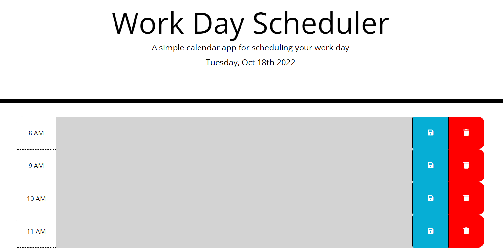

# Matts-Daily-Planner

## Description
The motivation for this project was to create a simple daily-task application that allows a user to save tasks for each hour of the of the work day.  The goal of the project was to utilize third-party API's such as jquery, bootstrap, google font, and moment to enhance the user interface.  The daily-planner has time-blocks listed from 8 AM to 5 PM with space for the user to input tasks for each our. The application also allows users to save/delete their tasks using local storage by clicking either the save or delete buttons located to the right of each time-block.  Additionally the application contains a color-coding feature that displays grey if the time-block is in the past, red if it is the current hour, and green if it is in the future.

## Screenshot

## Link to Deployed Site
https://mdlahey1.github.io/Matts-Daily-Planner/

## Link to GitHub Repository
https://github.com/mdlahey1/Matts-Daily-Planner
